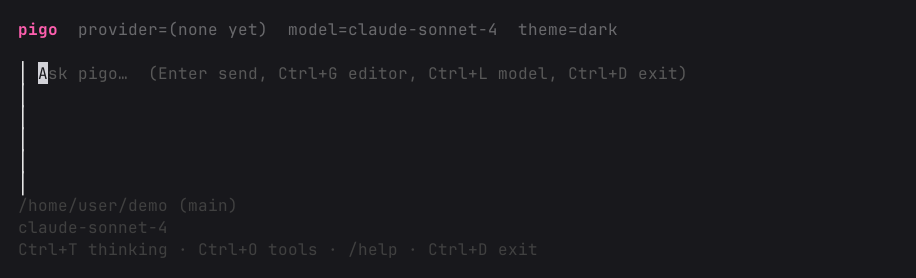

<p align="center">
  <picture>
    <source media="(prefers-color-scheme: dark)" srcset="docs/images/logo-dark.png">
    
  </picture>
</p>
<p align="center">
  <a href="https://github.com/Lowpower/pigo/actions/workflows/ci.yml"></a>
  <a href="https://github.com/Lowpower/pigo/releases"></a>
  <a href="https://go.dev/dl/"></a>
</p>

pigo is a terminal coding agent written in Go. Adapt it with [extensions](docs/extensions.md), [skills](docs/skills.md), [prompt templates](docs/prompt-templates.md), and [themes](docs/themes.md) — without forking the host. Put those resources in [packages](docs/packages.md) and share them via npm, git, or a local path.

It ships with useful defaults and four ways to run: an interactive TUI, print or JSON, RPC for process integration, and `pigo server` / `pigo client`. pigo does **not** export a stable Go library.

Full manual: [docs/README.md](docs/README.md). Samples: [examples/](examples/).

## Quick Start

Download a release archive from
[GitHub Releases](https://github.com/Lowpower/pigo/releases), extract it, and
put `pigo` on your `PATH`.

| OS | Arch | Asset |
| --- | --- | --- |
| Linux | amd64 | `pigo_*_linux_amd64.tar.gz` |
| Linux | arm64 | `pigo_*_linux_arm64.tar.gz` |
| macOS | amd64 | `pigo_*_darwin_amd64.tar.gz` |
| macOS | arm64 | `pigo_*_darwin_arm64.tar.gz` |
| Windows | amd64 | `pigo_*_windows_amd64.zip` |
| Windows | arm64 | `pigo_*_windows_arm64.zip` |

With Go 1.27+:

```bash
go install github.com/Lowpower/pigo/cmd/pigo@latest
```

Authenticate, then start a session in the project you want it to work on:

```bash
pigo auth login anthropic          # or openai, openrouter, …
cd /path/to/project
pigo                               # interactive TUI (needs a TTY)
pigo -p "summarize this repo"      # one prompt, then exit
```

By default the model gets `read`, `write`, `edit`, and `bash`. Add more through
[tools](docs/tools.md), [skills](docs/skills.md), [extensions](docs/extensions.md),
or [packages](docs/packages.md).

Credentials live in `~/.pigo/agent/auth.json`. Settings live in
`~/.pigo/agent/settings.json`. Override the config root with
`PIGO_CODING_AGENT_DIR`.

See [Quickstart](docs/quickstart.md) and [Usage](docs/usage.md) for flags and
slash commands.

## Providers & Models

Built-in providers include Anthropic, OpenAI, GitHub Copilot, Gemini, Amazon
Bedrock, OpenRouter, xAI, llama.cpp, and others. Authenticate with
`pigo auth login <provider>` (API key or OAuth where supported), then pick a
model with `/model` or `--model provider/id`.

`pigo --list-models` prints the current catalog. Add providers in
`~/.pigo/agent/models.json`, or via an extension. See
[providers](docs/providers.md) and [models](docs/models.md).

## Interactive Mode

<p align="center"></p>

From top to bottom:

- **Startup header** — `pigo`, provider, model, and theme
- **Messages** — your messages, assistant replies, tool calls, and notices
- **Editor** — where you type; `/` opens commands, Tab completes `@path`
- **Footer** — working directory, git branch, session name, token/cost usage,
  current model, and shortcuts (`/help` for the rest)

`--tui-mode` is `regular` (default) or `fullscreen`. See
[Usage](docs/usage.md) and [keybindings](docs/keybindings.md).

## Sessions

Each run that persists writes a JSONL file under `~/.pigo/agent/sessions/`.
`--continue` resumes the latest session for this directory; `--resume` and
`/resume` pick one; `--fork` / `/fork` / `/clone` branch history;
`/tree` jumps to a previous point.

`--export` and `/export` write a themed HTML transcript. `/share` publishes
the session (Radius when authenticated, otherwise a private GitHub gist).

See [sessions](docs/sessions.md), [session format](docs/session-format.md), and
[compaction](docs/compaction.md). Keep the on-disk JSONL schema stable.

## Customization

- [Extensions](docs/extensions.md) — subprocess binaries over framed JSON (`ext.Serve`)
- [Skills](docs/skills.md) — `SKILL.md` files the model can open
- [Prompt templates](docs/prompt-templates.md) — markdown that becomes `/name`
- [Themes](docs/themes.md) — TUI colour sets
- [Packages](docs/packages.md) — `pigo install` from npm, git, or a local path

Working samples live under [`examples/`](examples/).

## Programmatic usage

pigo does not export a stable Go library. Embed from:

- [`--mode rpc`](docs/rpc.md) — JSONL request/response on stdin/stdout
- [`--mode json`](docs/json.md) — JSONL agent events
- [`pigo server` / `pigo client`](docs/server.md) — Unix socket, same RPC

## Development

```bash
go build ./...
go test ./...
golangci-lint run ./...
go run ./cmd/pigo --help
go run ./cmd/pigo -p "hello"
```

The Cloud Agent environment is described in [AGENTS.md](AGENTS.md).

Inspired by [earendil-works/pi](https://github.com/earendil-works/pi).
